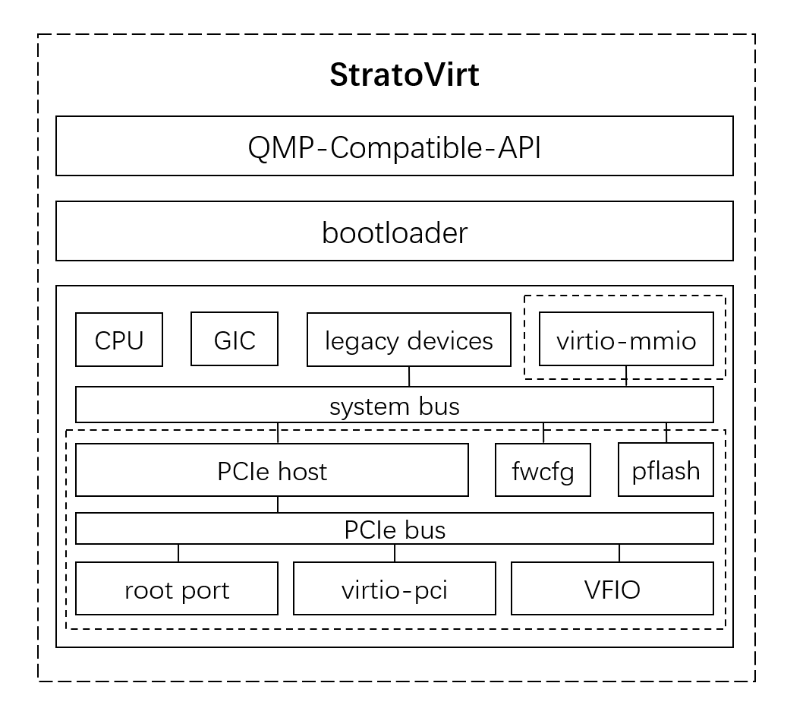

# StratoVirt设计

## 概述

StratoVirt是一种基于Linux内核的虚拟机（KVM）的开源轻量级虚拟化技术；
StratoVirt在保持传统虚拟化的隔离能力和安全能力的同时，降低了内存资源消耗，提高了虚拟机启动速度；
StratoVirt可以应用于微服务或函数计算等serverless场景；
StratoVirt保留了相应接口和设计，用于快速导入更多特性，直至支持标准虚拟化；

## 架构

StratoVirt的核心架构如下图所示，从上到下分为三层：

- OCI兼容API: StratoVirt使用QMP协议与外部系统通信，兼容OCI；
- BootLoader: StratoVirt使用简单的BootLoader加载内核镜像，而不像传统的繁琐的BIOS和Grub引导方式，实现快速启动；
- 轻量化：为了提高性能和减少攻击面，StratoVirt最小化了用户态设备的模拟；使用KVM仿真设备和半虚拟化设备，如GIC、串行、RTC和virtio设备；

 

## 特性

- 基于硬件的高隔离能力；
- 快速冷启动：得益于极简设计，StratoVirt可以在50ms内启动microVM；
- 低内存开销： StratoVirt的内存占用为4MB ；
- IO增强： StratoVirt提供普通IO能力与极简IO设备仿真；
- OCI兼容性：StratoVirt与isula和kata容器配合使用，可以完美融入Kubernetes生态系统；
- 多平台支持：全面支持Intel和ARM平台；
- 可扩展性：StratoVirt保留接口和设计，用于导入更多特性，甚至扩展到标准虚拟化支持；
- 安全性：运行时系统调用数小于35；

## 实现

#### 运行架构

- StratoVirt虚拟机是Linux中一个独立的进程。进程有两种线程：主线程和VCPU线程；
- 主线程是异步收集和处理来自外部模块（如VCPU线程）的事件的循环；
- 每个VCPU都有一个线程处理本VCPU的trap事件；

#### 约束

- 仅支持Linux操作系统，推荐内核版本为4.19；
- 客户端操作系统仅支持Linux，内核版本建议为4.19；
- StratoVirt在openEuler进行了全面测试；
- 最大支持254个CPU；
